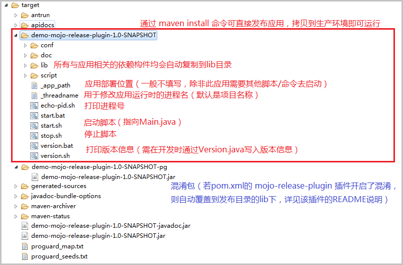

# 运行效果

------

## 发布应用后的应用结构



## 所生成的启动脚本内容

### win 环境启动脚本 start.bat

```shell
@echo off
title demo-release-project-plugin

set /p threadname=<.\.threadname
set lib0=.\lib

java -Dtn=%threadname% -Xms32m -Xmx64m  -cp %lib0%\demo-release-project-plugin.jar;%lib0%\exp-libs-simple.jar;%lib0%\exp-libs.jar;%lib0%\beauty-eye-3.7.jar;%lib0%\javase-2.2.jar;%lib0%\core-2.2.jar;%lib0%\dom4j-1.6.1.jar;%lib0%\javaini-1.1.0.0.jar;%lib0%\proxool-0.9.1.jar;%lib0%\proxool-cglib-0.9.1.jar;%lib0%\sqlite-jdbc-3.7.2.jar;%lib0%\poi-ooxml-3.9.jar;%lib0%\poi-3.9.jar;%lib0%\poi-ooxml-schemas-3.9.jar;%lib0%\dom4j-1.6.1.jar;%lib0%\json-lib-2.4-jdk15.jar;%lib0%\commons-beanutils-1.8.0.jar;%lib0%\commons-collections-3.2.1.jar;%lib0%\commons-lang-2.5.jar;%lib0%\ezmorph-1.0.6.jar;%lib0%\jackson-xc-1.9.9.jar;%lib0%\jackson-core-asl-1.9.9.jar;%lib0%\jackson-mapper-asl-1.9.9.jar;%lib0%\jackson-smile-1.9.9.jar;%lib0%\jackson-mrbean-1.9.9.jar;%lib0%\jackson-jaxrs-1.9.9.jar;%lib0%\jackson-core-lgpl-1.9.9.jar;%lib0%\jackson-mapper-lgpl-1.9.9.jar;%lib0%\commons-httpclient-3.1-rc1.jar;%lib0%\commons-net-3.3.jar;%lib0%\bcprov-jdk15on-1.54.jar;%lib0%\base64-1.0.jar;%lib0%\commons-compress-1.8.1.jar;%lib0%\commons-dbutils-1.5.jar;%lib0%\commons-io-2.4.jar;%lib0%\commons-logging-1.1.3.jar;%lib0%\commons-lang3-3.3.jar;%lib0%\xmlbeans-2.6.0.jar;%lib0%\stax-api-1.0.1.jar;%lib0%\commons-codec-1.8.jar;%lib0%\log4j-1.2.17.jar;%lib0%\slf4j-api-1.7.5.jar;%lib0%\logback-core-1.0.13.jar;%lib0%\logback-classic-1.0.13.jar;%lib0%\logback-access-1.0.13.jar; exp.libs.pojo.Main   2>err.log
pause
```

### unix 环境启动脚本 start.sh

```shell
#!/bin/bash
# demo-release-project-plugin

export app_path=$(cat ./_app_path|grep -v ^#)
if [ $app_path ];then
    cd $app_path
fi

export threadname=$(cat ./.threadname)
export lib0=./lib

PID=`ps -ef|grep Dtn=${threadname}|grep -v grep|awk '{print $2}'`
if [ -z $PID ];then
    java -Dtn=${threadname} -Xms32m -Xmx64m  -cp $lib0/demo-release-project-plugin.jar:$lib0/exp-libs-simple.jar:$lib0/exp-libs.jar:$lib0/beauty-eye-3.7.jar:$lib0/javase-2.2.jar:$lib0/core-2.2.jar:$lib0/dom4j-1.6.1.jar:$lib0/javaini-1.1.0.0.jar:$lib0/proxool-0.9.1.jar:$lib0/proxool-cglib-0.9.1.jar:$lib0/sqlite-jdbc-3.7.2.jar:$lib0/poi-ooxml-3.9.jar:$lib0/poi-3.9.jar:$lib0/poi-ooxml-schemas-3.9.jar:$lib0/dom4j-1.6.1.jar:$lib0/json-lib-2.4-jdk15.jar:$lib0/commons-beanutils-1.8.0.jar:$lib0/commons-collections-3.2.1.jar:$lib0/commons-lang-2.5.jar:$lib0/ezmorph-1.0.6.jar:$lib0/jackson-xc-1.9.9.jar:$lib0/jackson-core-asl-1.9.9.jar:$lib0/jackson-mapper-asl-1.9.9.jar:$lib0/jackson-smile-1.9.9.jar:$lib0/jackson-mrbean-1.9.9.jar:$lib0/jackson-jaxrs-1.9.9.jar:$lib0/jackson-core-lgpl-1.9.9.jar:$lib0/jackson-mapper-lgpl-1.9.9.jar:$lib0/commons-httpclient-3.1-rc1.jar:$lib0/commons-net-3.3.jar:$lib0/bcprov-jdk15on-1.54.jar:$lib0/base64-1.0.jar:$lib0/commons-compress-1.8.1.jar:$lib0/commons-dbutils-1.5.jar:$lib0/commons-io-2.4.jar:$lib0/commons-logging-1.1.3.jar:$lib0/commons-lang3-3.3.jar:$lib0/xmlbeans-2.6.0.jar:$lib0/stax-api-1.0.1.jar:$lib0/commons-codec-1.8.jar:$lib0/log4j-1.2.17.jar:$lib0/slf4j-api-1.7.5.jar:$lib0/logback-core-1.0.13.jar:$lib0/logback-classic-1.0.13.jar:$lib0/logback-access-1.0.13.jar: exp.libs.pojo.Main  >/dev/null 2>err.log &
else
    echo "The program $threadname has been running.Please stop it firstly."
fi
```

### unix 环境停止脚本 stop.sh

```shell
#!/bin/bash
# demo-release-project-plugin

export app_path=$(cat ./_app_path|grep -v ^#)
if [ $app_path ];then
    cd $app_path
fi

export threadname=$(cat ./.threadname)
PID=`ps -ef|grep Dtn=${threadname}|grep -v grep|awk '{print $2}'`
if [ $PID ];then
    kill $PID
    echo "The program $threadname is being killed, please wait for 10 seconds..."
    sleep 10

    PID=`ps -ef|grep Dtn=${threadname}|grep -v grep|awk '{print $2}'`
    if [ $PID ];then
        kill -9 $PID
    fi
    echo "Kill the program $threadname successfully."
else
    echo "The program $threadname has been stoped."
fi
```

### unix 环境线程号查看脚本 echo-pid.sh

```shell
#!/bin/bash
# demo-release-project-plugin

export app_path=$(cat ./_app_path|grep -v ^#)
if [ $app_path ];then
    cd $app_path
fi

export threadname=$(cat ./.threadname)
PID=`ps -ef|grep Dtn=${threadname}|grep -v grep|awk '{print $2}'`
if [ -z $PID ];then
    echo "The program $threadname has been stoped."
else
    echo $PID
fi
```

### win 环境版本查看脚本 version.bat

```shell
@echo off
title demo-release-project-plugin

set /p threadname=<.\.threadname
set lib0=.\lib

java -Dtn=%threadname% -Xms32m -Xmx64m  -cp %lib0%\demo-release-project-plugin.jar;%lib0%\exp-libs-simple.jar;%lib0%\exp-libs.jar;%lib0%\beauty-eye-3.7.jar;%lib0%\javase-2.2.jar;%lib0%\core-2.2.jar;%lib0%\dom4j-1.6.1.jar;%lib0%\javaini-1.1.0.0.jar;%lib0%\proxool-0.9.1.jar;%lib0%\proxool-cglib-0.9.1.jar;%lib0%\sqlite-jdbc-3.7.2.jar;%lib0%\poi-ooxml-3.9.jar;%lib0%\poi-3.9.jar;%lib0%\poi-ooxml-schemas-3.9.jar;%lib0%\dom4j-1.6.1.jar;%lib0%\json-lib-2.4-jdk15.jar;%lib0%\commons-beanutils-1.8.0.jar;%lib0%\commons-collections-3.2.1.jar;%lib0%\commons-lang-2.5.jar;%lib0%\ezmorph-1.0.6.jar;%lib0%\jackson-xc-1.9.9.jar;%lib0%\jackson-core-asl-1.9.9.jar;%lib0%\jackson-mapper-asl-1.9.9.jar;%lib0%\jackson-smile-1.9.9.jar;%lib0%\jackson-mrbean-1.9.9.jar;%lib0%\jackson-jaxrs-1.9.9.jar;%lib0%\jackson-core-lgpl-1.9.9.jar;%lib0%\jackson-mapper-lgpl-1.9.9.jar;%lib0%\commons-httpclient-3.1-rc1.jar;%lib0%\commons-net-3.3.jar;%lib0%\bcprov-jdk15on-1.54.jar;%lib0%\base64-1.0.jar;%lib0%\commons-compress-1.8.1.jar;%lib0%\commons-dbutils-1.5.jar;%lib0%\commons-io-2.4.jar;%lib0%\commons-logging-1.1.3.jar;%lib0%\commons-lang3-3.3.jar;%lib0%\xmlbeans-2.6.0.jar;%lib0%\stax-api-1.0.1.jar;%lib0%\commons-codec-1.8.jar;%lib0%\log4j-1.2.17.jar;%lib0%\slf4j-api-1.7.5.jar;%lib0%\logback-core-1.0.13.jar;%lib0%\logback-classic-1.0.13.jar;%lib0%\logback-access-1.0.13.jar; exp.libs.pojo.Version -p  2>err.log
pause
```

### unix 环境版本查看脚本 version.sh

```shell
#!/bin/bash
# demo-release-project-plugin

export app_path=$(cat ./_app_path|grep -v ^#)
if [ $app_path ];then
    cd $app_path
fi

export threadname=$(cat ./.threadname)
export lib0=./lib

PID=`ps -ef|grep Dtn=ver-${threadname}|grep -v grep|awk '{print $2}'`
if [ -z $PID ];then
    java -Dtn=ver-${threadname} -Xms32m -Xmx64m  -cp $lib0/demo-release-project-plugin.jar:$lib0/exp-libs-simple.jar:$lib0/exp-libs.jar:$lib0/beauty-eye-3.7.jar:$lib0/javase-2.2.jar:$lib0/core-2.2.jar:$lib0/dom4j-1.6.1.jar:$lib0/javaini-1.1.0.0.jar:$lib0/proxool-0.9.1.jar:$lib0/proxool-cglib-0.9.1.jar:$lib0/sqlite-jdbc-3.7.2.jar:$lib0/poi-ooxml-3.9.jar:$lib0/poi-3.9.jar:$lib0/poi-ooxml-schemas-3.9.jar:$lib0/dom4j-1.6.1.jar:$lib0/json-lib-2.4-jdk15.jar:$lib0/commons-beanutils-1.8.0.jar:$lib0/commons-collections-3.2.1.jar:$lib0/commons-lang-2.5.jar:$lib0/ezmorph-1.0.6.jar:$lib0/jackson-xc-1.9.9.jar:$lib0/jackson-core-asl-1.9.9.jar:$lib0/jackson-mapper-asl-1.9.9.jar:$lib0/jackson-smile-1.9.9.jar:$lib0/jackson-mrbean-1.9.9.jar:$lib0/jackson-jaxrs-1.9.9.jar:$lib0/jackson-core-lgpl-1.9.9.jar:$lib0/jackson-mapper-lgpl-1.9.9.jar:$lib0/commons-httpclient-3.1-rc1.jar:$lib0/commons-net-3.3.jar:$lib0/bcprov-jdk15on-1.54.jar:$lib0/base64-1.0.jar:$lib0/commons-compress-1.8.1.jar:$lib0/commons-dbutils-1.5.jar:$lib0/commons-io-2.4.jar:$lib0/commons-logging-1.1.3.jar:$lib0/commons-lang3-3.3.jar:$lib0/xmlbeans-2.6.0.jar:$lib0/stax-api-1.0.1.jar:$lib0/commons-codec-1.8.jar:$lib0/log4j-1.2.17.jar:$lib0/slf4j-api-1.7.5.jar:$lib0/logback-core-1.0.13.jar:$lib0/logback-classic-1.0.13.jar:$lib0/logback-access-1.0.13.jar: exp.libs.pojo.Version -p  2>err.log 
else
    echo "The program ver-$threadname has been running.Please stop it firstly."
fi
```
